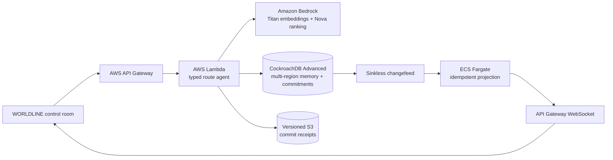

# WORLDLINE

> **The future has happened before. Remember it before machines move.**

WORLDLINE is a shared episodic memory and commitment plane for autonomous
machines. It retrieves a verified prior near-miss, uses that outcome to choose
a constrained maneuver, validates the maneuver with exact safety rules, and
atomically reserves a collision-free future in CockroachDB.

This repository is a standalone project for the
[CockroachDB × AWS Build with Agentic Memory Hackathon](https://cockroachdb-ai.devpost.com/).

## The two-minute proof

1. Two regional drone agents propose routes through the same future exclusion
   volume.
2. Bedrock embeds the live geometry and CockroachDB retrieves a 94%-similar
   verified near-miss from its distributed vector index.
3. That memory selects a vertical-separation maneuver from a closed candidate
   set.
4. The original routes race through two real serializable transactions.
5. CockroachDB commits one route and forces the conflicting agent to retry.
6. The remembered maneuver bends the second worldline above the conflict.
7. A changefeed independently observes the MVCC writes and turns both paths
   solid green.
8. The receipt links memory, decision, safety proof, HLC, and movement token.

The dashed coral route is the no-memory counterfactual. The lime route is the
future the agent chose because it remembered.

## Why CockroachDB is load-bearing

- **Distributed vector indexing:** Operational state and episodic memory remain
  in one transactionally consistent system.
- **Serializable transactions:** Future airspace, corridor capacity, route
  decisions, receipts, and movement commands commit together or not at all.
- **Multi-region SQL:** Regional-by-row operational state and global safety
  policy survive the loss of an entire configured region.
- **MVCC and `AS OF SYSTEM TIME`:** Every decision can be reconstructed from the
  precise historical world state that produced it.
- **Changefeeds:** The live UI becomes authoritative only after CDC independently
  observes the committed rows.
- **Spatial indexes:** Exact geometry narrows collision candidates; approximate
  vector search never makes a safety decision.

## Architecture



## Repository

```text
app/                         Interactive spacetime control room
services/agent/              Lambda API, planner, CockroachDB repository
services/agent/migrations/   Core and multi-region schema
services/changefeed/         Long-running CDC projection service
ops/                         ccloud and SQL health verification
docs/                        Architecture, safety, demo, and submission material
tests/                       Worker-rendered frontend verification
```

## Run the control room

Requires Node.js 22.13 or newer.

```powershell
npm install
npm run dev -- --port 5174
```

The frontend uses its deterministic, clearly labeled demo plane until
`NEXT_PUBLIC_WORLDLINE_API_URL` points to the agent API.

## Run the agent

```powershell
Set-Location services/agent
Copy-Item .env.example .env
npm install
npm run test
npm run dev
```

With a CockroachDB connection configured:

```powershell
npm run migrate
npm run seed
npm run smoke
npm run verify:database
```

Set `WORLDLINE_APPLY_MULTI_REGION=true` only when connected to the dedicated
three-region `worldline` database. Model and S3 calls stay outside retryable
transactions.

## Deploy

- `services/agent/template.yaml` deploys the HTTP API, WebSocket routes, Lambda
  functions, and versioned S3 receipt bucket.
- `services/changefeed/template.yaml` deploys the persistent Fargate CDC
  consumer after its image is published.
- The frontend deploys independently through Sites.

Production requires separate runtime, migration, CDC, and audit database
identities. Never use an administrator connection in application code.

## Safety boundary

WORLDLINE is a strategic reservation layer operating seconds ahead of motion,
not a hard-real-time flight controller. Onboard collision avoidance remains
authoritative. Vector search proposes memories; deterministic geometry,
capacity, battery, policy, and separation checks decide whether motion is
permitted.

## License

MIT
