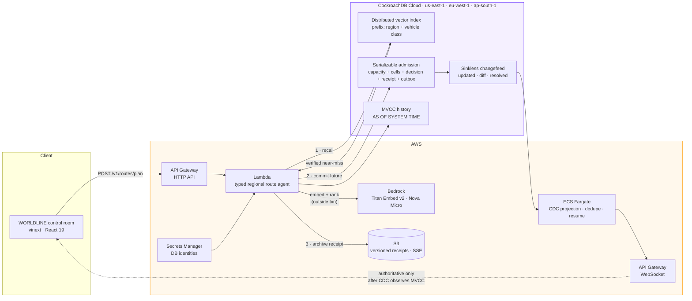

<div align="center">

# WORLDLINE

### Shared episodic memory and a globally serializable commitment plane for autonomous machines.

**The future has happened before. Remember it before machines move.**

[](LICENSE)
[](#cockroachdb-tools-used)
[](#aws-services-used)
[](#prerequisites)
[](https://cockroachdb-ai.devpost.com/)

**[▶ Run the demo in 90 seconds](#quickstart-90-seconds)** · [Architecture](#architecture) · [CockroachDB tools](#cockroachdb-tools-used) · [AWS services](#aws-services-used) · [Prove it yourself](#prove-it-yourself)

</div>

---

## What this is

Most agentic memory remembers *conversations*. WORLDLINE remembers **physical situations** — which geometry nearly failed, which maneuver actually worked, and whether that lesson is safe to apply right now.

It closes a loop that a vector store alone cannot close:

> **retrieve** a verified prior near-miss → **decide** a constrained maneuver from it → **prove** the maneuver with exact deterministic rules → **atomically reserve** a collision-free slice of the future.

All four steps land in **one transactionally consistent system**. The memory that caused a decision, the decision itself, the safety proof, the airspace reservation, and the signed movement token commit together or not at all. There is no window in which a machine has been told to move but the world has not yet recorded why.

## The problem

Two delivery drones from different operators, planning independently, will eventually claim the same cubic metres of sky at the same second. Today that is resolved by onboard last-second avoidance — reactive, fuel-expensive, and it discards the lesson. Nobody remembers that this exact merge angle at this closing speed in this crosswind already nearly failed six weeks ago.

Fleet coordination needs two things that are usually in two different databases:

| Need | Usually | Consequence |
|---|---|---|
| Semantic recall of similar past situations | Vector DB | Memory is eventually consistent with reality |
| Exclusive, conflict-free claims on the future | OLTP DB | Two systems, two clocks, dual-write races |

Split them and you get the worst failure mode in autonomy: **a machine that acts on a memory the world no longer agrees with.** WORLDLINE puts episodic memory and the commitment ledger in the same serializable transaction domain — which is precisely what CockroachDB's distributed vector indexing makes possible.

## The 100-second proof

1. Two regional drone agents propose routes through the same future exclusion volume. Conflict at `T+14.2s`.
2. The memory plane embeds the live geometry; CockroachDB's distributed vector index returns a **94%-similar verified near-miss** — same merge angle, closing speed, crosswind, battery asymmetry.
3. That memory selects a maneuver from a **closed, pre-validated candidate set** — the model may rank, never invent.
4. Both original routes race through **two real serializable transactions**.
5. CockroachDB commits one and returns `40001` to the other, which retries.
6. The remembered maneuver bends the second worldline **+38 m above** the conflict.
7. A **changefeed** independently observes the MVCC writes; only then do both paths turn solid green.
8. The receipt links memory → decision → safety proof → HLC timestamp → movement token.

The dashed coral route is the **no-memory counterfactual**, rendered alongside the lime route the agent chose *because it remembered*. The audience sees exactly what the memory changed.

## Agentic memory design

What makes this a memory *plane* rather than a similarity search:

**Memory is structured, not a text blob.** Each row carries the scenario, the exact `GEOMETRY(LINESTRING, 4326)` that produced it, the constraints in force, the maneuver taken, **the alternatives that were rejected**, the verified outcome, provenance, and confidence — alongside its `VECTOR(1024)` embedding ([`001_worldline_core.sql:1-25`](services/agent/migrations/001_worldline_core.sql)).

**Recall is filtered before it is approximate.** The vector index is *prefixed* on `(home_region, vehicle_class)`, and the query additionally constrains `outcome = 'verified-safe'`. An agent can only recall lessons from its own region, its own vehicle class, and only outcomes a human verified ([`repository.mjs:52-73`](services/agent/src/repository.mjs#L52-L73)).

**Recall is causally linked to the decision it caused.** Every retrieval writes a `memory_reads` row — rank, similarity, causal weight, exact-match flag — foreign-keyed to both the memory and the decision, inside the admitting transaction. The provenance chain is a queryable join, not a log line.

**Memory cannot authorize motion.** Vector search *proposes*; deterministic geometry, separation, capacity, battery, and policy checks *decide* ([`invariants.mjs`](services/agent/src/invariants.mjs)). This is the single most important design constraint in the system — see [Safety boundary](#safety-boundary).

**The past is reconstructable.** `AS OF SYSTEM TIME` replays the exact world state that produced any decision, from the HLC on its receipt ([`repository.mjs:955-1010`](services/agent/src/repository.mjs#L955-L1010)).

## Architecture



Source: [`docs/architecture.mmd`](docs/architecture.mmd) · Transaction contract: [`docs/TRANSACTIONS.md`](docs/TRANSACTIONS.md) · Threat model: [`docs/THREAT_MODEL.md`](docs/THREAT_MODEL.md)

---

## CockroachDB tools used

Three of the four eligible tool categories, each load-bearing at runtime or in the operational path.

### 1. Distributed Vector Indexing — *runtime episodic recall*

| | |
|---|---|
| **What the agent does with it** | Embeds the live scenario geometry to 1024 dimensions, then performs a prefix-filtered cosine KNN over verified past maneuvers to retrieve the top 3 analogous situations. That memory selects the separation maneuver the agent then attempts. |
| **Enabled** | `SET CLUSTER SETTING feature.vector_index.enabled = true` — [`001_worldline_core.sql:1`](services/agent/migrations/001_worldline_core.sql#L1) |
| **Column** | `embedding VECTOR(1024) NOT NULL` — [`001_worldline_core.sql:18`](services/agent/migrations/001_worldline_core.sql#L18) |
| **Index** | `CREATE VECTOR INDEX maneuver_memory_vector_idx ON maneuver_memories (home_region, vehicle_class, embedding vector_cosine_ops) WITH (min_partition_size = 16, max_partition_size = 128)` — [`002_multiregion.sql:23-29`](services/agent/migrations/002_multiregion.sql#L23-L29) |
| **Query** | `1 - (embedding <=> $3::VECTOR) AS similarity … ORDER BY embedding <=> $3::VECTOR LIMIT 3` — [`repository.mjs:52-73`](services/agent/src/repository.mjs#L52-L73) |

The **prefix columns are the point**: recall is scoped to the agent's own region and vehicle class *inside the index*, so an approximate search can never surface a lesson from an incompatible airframe or jurisdiction.

Alongside it, `GIST` spatial indexes on route and airspace geometry ([`001:22-23,44-45`](services/agent/migrations/001_worldline_core.sql#L22-L23)) narrow collision candidates **exactly** — approximate vector search never makes a safety decision.

### 2. ccloud CLI — *pre-flight control-plane verification*

| | |
|---|---|
| **What the agent does with it** | Before the demo admits any motion, the operator agent shells out to `ccloud` to produce a signed JSON health receipt: cluster topology, region list, and backup inventory — then joins it with an in-database check of region list, vector index presence, and running changefeed count. It **fails closed** if the authoritative world state cannot be read. |
| **Implementation** | [`ops/cluster-health.ps1`](ops/cluster-health.ps1) — `ccloud cluster info --format json`, `ccloud cluster backup list --format json` |
| **Run** | `./ops/cluster-health.ps1 -ClusterName worldline -DatabaseUrl $env:WORLDLINE_DATABASE_URL` |

```powershell
# emits outputs/worldline-cluster-health.json
{ "cluster": {...}, "backups": [...], "expectedRegions": ["us-east-1","eu-west-1","ap-south-1"],
  "sql": { "regions": [...], "vectorIndex": true, "changefeeds": 1 } }
```

### 3. Agent Skills — *constraining what the agent is allowed to do*

Three skills encode the non-negotiable rules that keep an LLM-driven agent from writing an unsafe transaction, over-privileging itself, or admitting motion against a stale world.

| Skill | Constrains |
|---|---|
| [`designing-worldline-transactions`](services/agent/skills/designing-worldline-transactions.SKILL.md) | Model/embedding/S3 calls complete **before** `BEGIN`; all reservation mutations go as one short serializable unit; `40001` → bounded retry with jitter; `40003` → resolve via idempotency journal; never issue a movement token unless capacity, cells, decision, receipt, and outbox commit together. |
| [`hardening-worldline-privileges`](services/agent/skills/hardening-worldline-privileges.SKILL.md) | Four separate DB identities. Migration identity owns DDL and is never reachable from runtime. Runtime may mutate only route/receipt/outbox tables. CDC identity holds `SELECT` + `CHANGEFEED` only. Audit identity is read-only. |
| [`reviewing-worldline-health`](services/agent/skills/reviewing-worldline-health.SKILL.md) | Require all three regions available; verify survival goal, table localities, vector index, changefeed status, and current backups before destructive schema work. Fail closed. |

These are enforced in code, not just documented — see the retry loop at [`repository.mjs:758`](services/agent/src/repository.mjs#L758) and role provisioning in [`scripts/provision-roles.mjs`](services/agent/scripts/provision-roles.mjs).

> **Not used:** CockroachDB Cloud Managed MCP Server. The hackathon requires two of four categories; we use three, and we would rather cite three we genuinely depend on than claim four.

### Beyond the tool list — why CockroachDB is irreplaceable here

| Capability | Load-bearing use | Reference |
|---|---|---|
| **Serializable isolation** | The admission transaction is the product. Two agents racing for one corridor is the demo's central moment. `BEGIN ISOLATION LEVEL SERIALIZABLE` | [`repository.mjs:826`](services/agent/src/repository.mjs#L826) |
| **`40001` retry contract** | The loser genuinely retries and re-reads capacity, then takes the remembered alternative | [`repository.mjs:758`](services/agent/src/repository.mjs#L758) |
| **Multi-region SQL** | `SURVIVE REGION FAILURE`; 14 tables `REGIONAL BY ROW` near their agents; `safety_policies` is `GLOBAL` so policy stays locally readable everywhere | [`002_multiregion.sql`](services/agent/migrations/002_multiregion.sql) |
| **MVCC + `AS OF SYSTEM TIME`** | Reconstruct the precise historical world that produced any decision, from the receipt's HLC | [`repository.mjs:955-1010`](services/agent/src/repository.mjs#L955-L1010) |
| **Changefeeds** | The UI becomes authoritative only after CDC independently observes committed rows — not optimistic UI | [`consumer.mjs:59-100`](services/changefeed/src/consumer.mjs#L59-L100) |
| **Spatial (`GIST`)** | Exact geometric collision candidates; approximate search never decides safety | [`001_worldline_core.sql`](services/agent/migrations/001_worldline_core.sql) |
| **Unique constraints as physics** | `UNIQUE (cell_id, slot_start, exclusion_slot)` makes double-booking the sky a *database* error, not application logic | [`001_worldline_core.sql`](services/agent/migrations/001_worldline_core.sql) |

---

## AWS services used

| Service | What it does here | Reference |
|---|---|---|
| **AWS Lambda** | The typed decision boundary. One function serves the HTTP API (plan / commit / world / receipts / demo controls); a second serves WebSocket connect-disconnect-default routes. Zod-validated request contracts. | [`template.yaml:55,84`](services/agent/template.yaml) · [`src/index.mjs`](services/agent/src/index.mjs) |
| **Amazon Bedrock** | Two narrow jobs behind a provider boundary: **Titan Text Embeddings v2** produces the normalized 1024-d scenario embedding; **Nova Micro** ranks the closed maneuver candidate set at `temperature: 0`, `maxTokens: 120`. Output is Zod-parsed against an enum of existing maneuver IDs — a hallucinated maneuver is structurally rejectable. Both calls complete **outside** the transaction. | [`providers.mjs:22-97`](services/agent/src/providers.mjs) |
| **Amazon ECS (Fargate)** | Long-running changefeed consumer — cannot be a Lambda, because a sinkless changefeed is a persistent SQL cursor. Dedupes at-least-once delivery and resumes from the highest recorded MVCC timestamp. | [`changefeed/template.yaml:18,96`](services/changefeed/template.yaml) |
| **Amazon S3** | Versioned, `AES256`-encrypted commit receipts keyed `receipts/{id}.json`, with the SHA-256 content hash stored both in object metadata and in the `commit_receipts` row for tamper evidence. | [`evidence.mjs`](services/agent/src/evidence.mjs) · [`template.yaml:147`](services/agent/template.yaml) |
| **Amazon API Gateway** | HTTP API for agent requests; WebSocket API pushes CDC-confirmed state to the control room. | [`template.yaml:47,77`](services/agent/template.yaml) |
| **AWS Secrets Manager** | Supplies the four separate database identities. No credential is ever stored in source. | [`scripts/inspect-live-database.mjs`](services/agent/scripts/inspect-live-database.mjs) |
| **AWS SAM / CloudFormation** | Both stacks are infrastructure-as-code; CodeBuild `buildspec.yml` publishes the CDC image. | [`template.yaml`](services/agent/template.yaml) · [`buildspec.yml`](services/changefeed/buildspec.yml) |

### The provider boundary, honestly

`embedScenario` and `rankManeuvers` are wired to Bedrock and **fall back to a deterministic, clearly-labeled 1024-d feature-hash embedding and a rule-based ranker** when the Bedrock call fails for any reason — including `NOT_AUTHORIZED` model access ([`providers.mjs:42-46`](services/agent/src/providers.mjs#L42-L46)). Every response reports which provider served it (`"amazon-bedrock"` or `"deterministic"`), so the UI and receipts never overstate what happened.

This is not a workaround bolted on for the demo — it is the degradation path a safety-adjacent system needs. **A model outage must not be able to stop the commitment plane, and it must never silently change the decision contract.** The safety rules, the transaction shape, and the receipt schema are byte-identical on both paths.

---

## The admission transaction

A movement token may exist **only** when the same transaction has done all seven ([`docs/TRANSACTIONS.md`](docs/TRANSACTIONS.md)):

1. Read the active safety-policy version
2. Consumed corridor capacity (`CHECK (used <= capacity)`)
3. Inserted every rolling-horizon exclusion claim
4. Stored the route decision **and its memory dependency**
5. Stored deterministic safety results
6. Created a commit receipt
7. Appended the command to the idempotent outbox

**Retry protocol.** `SERIALIZABLE` (the CockroachDB default). Model, embedding, and S3 work happens before `BEGIN`. `40001` → bounded retry with jitter; the retry re-reads capacity and may take the already-prepared alternative. `40003` is treated as ambiguous and resolved from the request idempotency key. No S3, model, or actuator call ever runs inside a transaction.

**Changefeed contract.** CDC is not a source of truth — CockroachDB is. The consumer assumes at-least-once delivery and per-key ordering only, persists `(source_table, source_key, mvcc_timestamp)` *before* broadcasting, and reconnects from the largest recorded timestamp.

## Safety boundary

WORLDLINE is a **strategic reservation layer operating seconds ahead of motion — not a hard-real-time flight controller.** Onboard collision avoidance remains authoritative at all times.

- Vector search **proposes** memories. Deterministic geometry, capacity, battery, policy, and separation checks **decide** whether motion is permitted.
- The model chooses only among pre-validated maneuvers; it cannot author one.
- A memory with `outcome != 'verified-safe'` is unreachable by recall.
- If the current authoritative world state cannot be read, the system **fails closed**.

Stating this boundary is not hedging. An agentic system that touches physical motion and *cannot* articulate what its model is forbidden from doing is not production-ready.

## Production readiness

| Concern | Approach |
|---|---|
| **Least privilege** | Four DB identities — migration / runtime / CDC / audit. Runtime cannot alter schema; audit is read-only. Provisioned by [`provision-roles.mjs`](services/agent/scripts/provision-roles.mjs). Never an admin connection in application code. |
| **Idempotency** | `api_idempotency` journal with `owner_token` + request hash; ambiguous-commit (`40003`) resolves through it. Command outbox is idempotent by construction. |
| **Tamper evidence** | Every accepted future produces a receipt hashed with SHA-256, stored in-row and in versioned S3 with the hash in object metadata. |
| **Observability** | CDC confirmation table doubles as an audit log (`cdc_by_observed_time`); `broker_events` records region connect/disconnect/recover; ccloud health receipts are persisted JSON artifacts. |
| **Resilience** | `SURVIVE REGION FAILURE`; the demo deliberately kills the Europe broker and the commitment plane stays available. Provider fallback on model failure. Fail-closed on unreadable world state. |
| **Secrets** | AWS Secrets Manager only. `.env` files are gitignored; `.env.example` ships placeholders. |
| **Tests** | `node --test` suites for config, database, HTTP contracts, invariants, and CDC projection, plus worker-rendered frontend verification. |

---

## Quickstart (90 seconds)

### Prerequisites

- **Node.js ≥ 22.13** (`node --version`)
- Optional for the full stack: a CockroachDB Cloud cluster, `ccloud` + `cockroach` CLIs, AWS credentials

### 1. Control room only — no cloud credentials needed

```bash
git clone https://github.com/AdarshSingh-ASR/WorldLine.git
cd WorldLine
npm install
npm run dev -- --port 5174
```

Open **http://localhost:5174**. The frontend runs its deterministic, clearly-labeled demo plane until `NEXT_PUBLIC_WORLDLINE_API_URL` points at a live agent — so the visual proof is reviewable in under two minutes with zero setup. Click **Commit both futures**.

### 2. Add the live agent

```bash
cd services/agent
cp .env.example .env      # PowerShell: Copy-Item .env.example .env
npm install
npm test                  # config, database, HTTP, invariant suites
npm run dev               # http://127.0.0.1:8790
```

Then point the frontend at it:

```bash
# .env in the repo root
NEXT_PUBLIC_WORLDLINE_API_URL=http://127.0.0.1:8790
NEXT_PUBLIC_WORLDLINE_WEBSOCKET_URL=ws://127.0.0.1:8791/live
```

### 3. Add CockroachDB

Set `WORLDLINE_DATABASE_URL` and `WORLDLINE_MIGRATION_DATABASE_URL` in `services/agent/.env`, then:

```bash
npm run provision:roles   # four least-privilege identities
npm run migrate           # core schema + vector index
npm run seed              # verified maneuver memories
npm run smoke             # end-to-end race against the real cluster
npm run verify:database   # regions, localities, vector index, changefeeds
```

Set `WORLDLINE_APPLY_MULTI_REGION=true` **only** when connected to the dedicated three-region `worldline` database.

### 4. Configuration reference

| Variable | Purpose |
|---|---|
| `WORLDLINE_DATABASE_URL` | Runtime identity — least privilege, `sslmode=verify-full` |
| `WORLDLINE_MIGRATION_DATABASE_URL` | Migration identity — never used by application code |
| `WORLDLINE_AWS_REGION` | S3 / Secrets Manager region (`us-east-1`) |
| `WORLDLINE_BEDROCK_REGION` | Bedrock region (`eu-west-1`) |
| `WORLDLINE_EMBED_MODEL_ID` | `amazon.titan-embed-text-v2:0` |
| `WORLDLINE_BEDROCK_MODEL_ID` | `eu.amazon.nova-micro-v1:0` |
| `WORLDLINE_RECEIPT_BUCKET` | Versioned S3 receipt bucket (blank ⇒ hash-only, no archive) |
| `WORLDLINE_ALLOWED_ORIGIN` | CORS origin for the control room |
| `WORLDLINE_APPLY_MULTI_REGION` | `true` only on the three-region cluster |
| `WORLDLINE_PROVIDER_DIAGNOSTICS` | `true` to log provider fallback reasons |

### 5. Deploy

```bash
sam deploy -t services/agent/template.yaml          # HTTP + WebSocket API, Lambdas, versioned S3
# publish the CDC image via services/changefeed/buildspec.yml, then:
sam deploy -t services/changefeed/template.yaml     # persistent Fargate CDC consumer
```

The frontend deploys independently. **Production requires separate runtime, migration, CDC, and audit database identities.**

## Prove it yourself

Don't take the README's word for any of it:

```bash
# The vector index actually exists, with cosine ops and prefix columns
cockroach sql --url $WORLDLINE_DATABASE_URL -e "SHOW INDEXES FROM maneuver_memories;"

# The database is genuinely configured to survive losing a region
cockroach sql --url $WORLDLINE_DATABASE_URL -e "SHOW REGIONS FROM DATABASE worldline;"

# A changefeed is genuinely running
cockroach sql --url $WORLDLINE_DATABASE_URL -e "SHOW CHANGEFEED JOBS;"

# Two agents genuinely contend for one corridor and one gets 40001
cd services/agent && node --env-file=.env scripts/run-live-contention-test.mjs

# Regions, localities, vector index, and CDC in one report
npm run verify:database

# Control-plane topology + backup receipt via ccloud
./ops/cluster-health.ps1 -ClusterName worldline -DatabaseUrl $env:WORLDLINE_DATABASE_URL
```

## API surface

| Method | Path | Purpose |
|---|---|---|
| `GET` | `/health` | Cluster reachability, regions, CDC status |
| `GET` | `/v1/scenario` | Live scenario, agent roster, corridor capacity, active policy, closed maneuver set |
| `GET` | `/v1/regions` | Per-region health from `SHOW REGIONS` joined with the latest broker event |
| `GET` | `/v1/events` | Changefeed confirmations newer than a cursor — drives the live indicator |
| `GET` | `/v1/world` | Current authoritative world, read at a pinned HLC |
| `POST` | `/v1/routes/plan` | Recall memory → rank maneuver → validate → admit |
| `POST` | `/v1/routes/{id}/commit` | Commit a planned future |
| `POST` | `/v1/routes/{id}/extend` | Extend a rolling-horizon reservation |
| `GET` | `/v1/receipts/{id}` | Full provenance chain for one decision |
| `POST` | `/v1/demo/race` | Run the two-agent contention scenario |
| `POST` | `/v1/demo/broker-failure` | Take a region's broker offline (writes `broker_events`) |
| `POST` | `/v1/demo/broker-recover` | Bring a region's broker back online |
| `POST` | `/v1/demo/reset` | Reset corridor capacity |

All mutating routes require an `x-idempotency-key` header.

### The control room reads only committed state

The interface has no seeded scenario and no simulated pacing. Every value it
renders — routes, corridors, agents, regions, similarity scores, retry counts,
HLC timestamps, receipts — arrives from the endpoints above. Phase transitions
are driven by request lifecycles rather than timers, the route that bends is the
one the database actually returned with `useAlternate`, the bend magnitude is
the real `achievedSeparationM`, and the live indicator only advances when
`/v1/events` reports genuinely new CDC rows.

If the agent has no database, it answers `503` instead of fabricating a
decision, and the control room renders an explicit unavailable state.
`WORLDLINE_DEMO_FALLBACK=true` is the only way to get synthetic responses; those
are flagged `synthetic: true` and the interface refuses to present them as a
commit.

## Repository map

```text
app/
  page.tsx                    Server shell
  lib/worldline.ts            Typed agent client — the only data boundary
  components/ControlRoom.tsx  Orchestrator, telemetry rail, transaction log
  components/AirspaceViewport.tsx  Canvas viewport, derived geometry
  components/ReceiptDrawer.tsx     Provenance / show-your-work surface
worker/                       Edge entry point for the control room
services/agent/
  src/index.mjs               Lambda HTTP boundary, typed routes
  src/repository.mjs          Vector recall, serializable admission, MVCC replay
  src/invariants.mjs          Deterministic safety rules + closed maneuver set
  src/providers.mjs           Bedrock boundary + deterministic fallback
  src/evidence.mjs            Receipt hashing + S3 archive
  migrations/                 Core schema, vector index, multi-region localities
  skills/                     CockroachDB Agent Skills (3)
  scripts/                    migrate · seed · smoke · verify · contention test
services/changefeed/          Persistent Fargate CDC projection (dedupe + resume)
ops/cluster-health.ps1        ccloud + SQL health receipt
docs/                         Architecture · transactions · threat model · demo script
tests/                        Worker-rendered frontend verification
infra/bootstrap.yaml          Bootstrap infrastructure
```

## How this maps to the judging criteria

| Criterion | Where to look |
|---|---|
| **Agentic Memory Design** | [Agentic memory design](#agentic-memory-design) — structured episodic rows, prefix-scoped recall, `memory_reads` causal links, memory-cannot-authorize-motion |
| **Technical Implementation** | Real `VECTOR(1024)` + cosine index, real `40001` retry loop, `AS OF SYSTEM TIME` replay, sinkless CDC with dedupe and cursor resume, Zod-typed boundaries, 5 test suites |
| **Real-World Impact** | [The problem](#the-problem) — multi-operator airspace deconfliction, directly transferable to warehouse AMRs, port automation, and any fleet claiming exclusive physical slots |
| **Production Readiness** | [Production readiness](#production-readiness) — four least-privilege identities, idempotency journal, hash-chained receipts, region-failure survival, fail-closed, documented safety boundary |
| **Creativity & Originality** | Memory that *does cognitive work* on physical futures, the rendered no-memory counterfactual, and treating a `UNIQUE` constraint as a law of physics |

## Honest limitations

- Strategic layer only, seconds ahead of motion. Not a flight controller. Onboard avoidance stays authoritative.
- Seeded memories are synthetic-but-structured; a production deployment would ingest verified incident reports.
- The demo scenario is a fixed two-agent contention case, chosen because it is legible in 100 seconds — the transaction and recall paths are not demo-specific.
- Bedrock model access is per-account; the deterministic fallback keeps the system fully functional and clearly labeled when it is unavailable.

## License

[MIT](LICENSE) — see the `LICENSE` file.

---

<div align="center">

**The future has happened before. Remember it before machines move.**

Built for the [CockroachDB × AWS Build with Agentic Memory Hackathon](https://cockroachdb-ai.devpost.com/)

</div>
